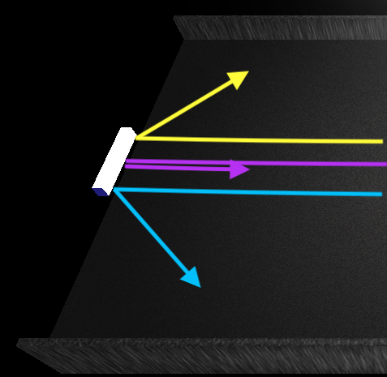

Pong Game in Three.js
--------------------------

Všechen javascriptový kód je v souboru app.js. Kód je částečně okomentovaný (hlavně části, které by nemusely být na první pohled zřejmé)

###### Ovládání:
- ovládání hry - pravý hráč šipky, levý hráč klávesy W a S. (nápověda přímo po spuštění)
- možnost pauznutí hry klávesou ESC.
- možnost zapnutí/vypnutí zvuku tlačítkem, nebo klávesou "M"
- možnost skrýt a zobrazit nápovědu na ovládání tlačítkem Hide/Show help, nebo klávesou "H"
- spuštit hru jde také klávesou "Enter" (nebo tlačítko "Start Game!")

###### Nastavení hry:
- dá se nastavit hra pro 2 nebo pro 1 hráče.
- 1 hráč - možnost nastavení obtížnosti AI protivníka (rychlost hry podle protivníka)
- 2 hráči - možnost nastavení rychlosti hry
- hra je nastavena tak, že vítěz musí dosáhnout 11 bodů/gólů (podle GamePlaye na anglické Wikipedii), dá se kdyžtak změnit konstantou v kódu.

###### Odraz balónku:
- od stěny se odráží klasicky úhel odrazu = úhel dopadu
- od hráče se odráží tímto způsobem:
    - míček ztratí svůj původní směr a odrazí se podle toho, jakou část pálky trefil
    - když trefí střed pálky, odrazí se vodorovně
    - když trefí kraj pálky, odrazí se pod nejvyšším úhlem do strany (horní kraj pálky - nahoru, dolní kraj pálky - dolu)
    - takže čím blíže ke středu, tím menší úhel
- při menším úhlu odrazu se trochu zvýší rychlost balónku, je to pro lepší hratelnost, protože je lépe poznat, kam bálonek poletí

 
(Obrázek odrazů balónku, kdyžtak možné najít ve složce images/readme_img)

###### Další info:
- po zapnutí hry zmizí ukazatel myši aby nepřekážel
- zamezil jsem šipkám aby fungovali jako PageUp a PageDown klávesy, aby se při zmenšení obrazovky při hře neposouvala obrazovka při pohybu pravého hráče
- po spuštění hry a po gólu vždy jede míček trochu pomaleji (do prvního odpálení), aby měl hráč možnost zareagovat na směr rozjetí balónku
- přehrávání různých zvuků při:
    - gólech
    - odrazu balónku od pálky
    - konci hry
